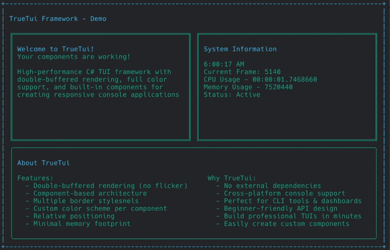

# TrueTui

A high‑performance C# TUI framework with double‑buffered rendering, full‑colour support and built‑in components for building responsive console applications.

## Features

- Double‑buffered rendering for smooth updates  
- Full 24‑bit colour support in the console  
- Ready‑made UI components (layouts, controls, etc)  
- Lightweight, zero external dependencies  

## Getting Started

1. Clone the repo  
2. Add the `TrueTui` project/reference to your solution  
3. Create a new console‑app and bootstrap the framework  
4. Explore the `Components/` and `Core/` folders for usage examples  

## Why Use TrueTui?

If you’re building a tool, dashboard or interactive console app in C#, and you want more control, better performance and rich UI capabilities — this framework gives you a solid foundation.

## Contributing

Pull requests are welcome. Please follow the code style and write unit tests for any new features.

## License

Licensed under the MIT License.  
